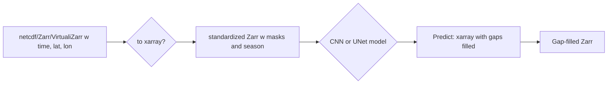
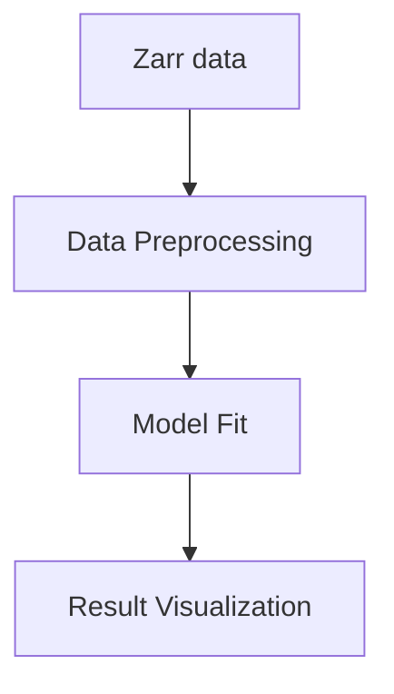

# Mind the Gap

This builds on work started during GeoHackWeek 2024 and OceanHackWeek 2025 ([proj_gap](https://github.com/oceanhackweek/ohw25_proj_gap)). The summer goal is to create a proof of concept for training global gap-filling models for single-variable ocean color data (e.g. chl) and for multi-variable data (e.g. multiple spectra) as a stretch goal. Similar in concept to https://github.com/EhsanMehdipour/PFT_gapfilling.  The main model (currently) is a U-Net model developed by our interns in 2024/25, but we also hope to explore other gap-filling algorithms working (DINCAE and DINEOF) or at least describe them.

The basic approach is the following:


Functions are in `mindthegap` directory. Notebooks are in the `book` directory.
```
import mindthegap as mtg
```

## Collaborators

| Name                | Role                |
|---------------------|---------------------|
| [Eli Holmes](https://github.com/eeholmes)      | Project Facilitator |
| [Troy Russo](https://github.com/troyrusso)       | 2026 Varanasi Intern         |
| [Kaira Nair](https://github.com/kai-110)       | Participant         |

## Background

Gaps in ocean color remote sensing data limits use of these data and gap-filled products are needed. However it would be most convenient to be able to gap-fill arbitrary products (or dates) and to gap-fill multivariate products.

**Issues**

* One issue has been fragile workflows. Code/notebooks that work now don't work later. We find this both for our own code and for code of others that we have tried to apply. How do we create a more robust gap-filling approach?
* Another issue is how to develop a global model that is not trained on the whole globe since what works in Indian Ocean is not tuned for Eastern Pacific Ocean.


## Datasets

```
import xarray as xr
dataset = xr.open_dataset(
    "gcs://nmfs_odp_nwfsc/CB/mind_the_chl_gap/IO.zarr",
    engine="zarr",
    backend_kwargs={"storage_options": {"token": "anon"}},
    consolidated=True
)
dataset
```

## Workflow/Roadmap


## Lessons Learned from OHW25
* Working with outdated packages can be quite challenging.
* Existing frameworks (e.g., DINCAE) can serve as inspiration but need to be adapted to the specific context.
* Pay attention to memory efficiency — document how much memory is required to run your code and data.
* Collaboration and thorough documentation help improve workflow efficiency.
* Avoid using `to_numpy()` on the full dataset (time, lat, lon, var). Instead, stream patches directly from the Zarr files in batches or use [dask](https://www.dask.org/).
* Xarray is powerful, with advanced options available in [icechunk](https://github.com/earth-mover/icechunk) and [cubed](https://github.com/cubed-dev/cubed).

## References
* [PFT_gapfilling](https://github.com/EhsanMehdipour/PFT_gapfilling)

## Creating the JupyterBook

Create template in `book` directory
```
pip install -U jupyter-book
jupyter-book create book
```

Build and push to GitHub. Make sure you are in `book` dir.
```
jupyter-book build .
ghp-import -n -p -f _build/html
```

