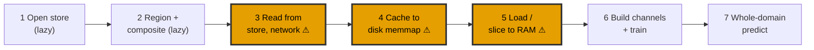

# Meeting prep: scaling toward global, and a persistence fix

*Where the pipeline hangs up for global, why the global and big-cloud runs run out of memory, what
infrastructure would unblock it, and a fairness fix for the persistence baseline.*

## 1. The pipeline, and where it hangs up

What each step actually does:

1. **Open store (lazy).** Connect to the GlobColour dataset on source.coop and open it as an xarray dataset.
   Only the metadata is read here, the grid size, the variable names, the list of dates, not any pixel values.
   So it is instant regardless of how big the dataset is.
2. **Region and composite (lazy).** Say which area we want, for example the Arabian Sea box, and optionally
   average the daily frames into multi-day composites to fill some gaps. These are still just instructions
   attached to the dataset object. No pixel data has been read yet.
3. **Read from store, over the network.** The point where the actual pixel values are pulled off the remote
   store. This is the first time real data moves, and it is the slow part of the whole pipeline.
4. **Cache to disk (memmap).** Write what was read to a local disk file as a memory-mapped array, so the slow
   store only has to be read once. A memory-mapped file lets us later pull small pieces from fast local disk
   without loading the whole thing, which is what makes streaming during training possible.
5. **Load or slice to RAM.** Bring the cached data, or just a recent slice of it, into working memory as a
   plain array for the training loop to draw from.
6. **Build channels and train.** Turn the chlorophyll cube into the model's inputs, the masked value, the
   previous and next days, position, day of year, and the land and cloud flags, lay the synthetic fake clouds
   over it, and train the U-Net on small spatial tiles fed through tf.data.
7. **Whole-domain predict.** Run the trained model over the full region, or the globe, in a single forward
   pass to produce the gap-filled map.

Steps 1, 2, 6, and 7 scale fine. The three marked steps are where going global breaks, and all three are
infrastructure, not method:

- **Step 3, the read, is network-bound and does not get cheaper with resolution.** Pulling the data off the
  remote store is the real cost, and it is slow, a few MB per second effective. Coarsening does not help here:
  averaging 16x16 blocks still has to read every 4 km cell to average them, so a global 4 km read is the full
  data volume no matter what resolution we end up training on.
- **Step 4, the cache, cannot be written right now.** The intent is to cache once to disk and then stream
  tiles from it, so the whole cube never has to sit in memory. That is currently blocked: the home directory
  reports about 128 GB free, but every write fails with a no-space error, which looks like a quota or a
  tripped soft-limit rather than real disk being full. Because the cache cannot be saved, it ends up held in
  memory instead, and it also cannot be reused across sessions, so every restart pays the slow read again.
- **Step 5, the load, then has to fit the whole cube in RAM,** because step 4 cannot stream it from disk. The
  regional daily cube is already 10.6 GB and runs the kernel out of memory when loaded and worked on. A global
  cube would be 10 to 100 times larger, so this is the hard wall for global as things stand.

## 2. Why the global run and the big-cloud run run out of memory

**Global, 4 km.** One global frame at 4 km is 4320 x 8640 = 37 million pixels = 149 MB. A single year of daily
frames is about 55 GB; a multi-year record is hundreds of GB. Because the disk cache cannot persist (step 4),
the pipeline holds the cube in RAM at step 5, so even a modest global slice exceeds memory. Coarsening to
64 km makes the trained grid tiny (270 x 540, a few hundred KB per frame), but you have to read and hold the
full 4 km data first in order to average it, so the out-of-memory happens before coarsening helps.

**Big clouds, blob_sigma about 50.** The gap measurement showed real cloud gaps are roughly five times larger
than the synthetic clouds we had been using. Testing at that realistic size needs two things that both cost
memory: the fake clouds have to be large (blob_sigma about 50), and the training tiles have to be larger than
the clouds (160 x 224 instead of 40 x 56). Three things then pile up in memory at step 6: the synthetic-cloud
generator is a Gaussian blur, and at sigma 50 its kernel is huge and it allocates large temporary arrays, and
it re-runs every training step; the validation set, a fixed batch of tiles held back to score the model each
epoch, is tiles times frames times about 34 channels, several GB that stays resident in memory the whole run;
and all of this sits on top of the already-large cube from step 5. The combination is what crashes the kernel,
usually within the first epoch.

## 3. Infrastructure questions for the meeting

The blockers are storage, memory, and data-access speed. Concretely:

- **A writable, larger cache location.** The cache currently lands in a small temp directory, and the home
  quota blocks writes elsewhere. We need a disk location with room for tens to hundreds of GB that we can
  actually write to, so the cube can persist and stream from disk instead of living in RAM. Is there a scratch
  or project volume for this? (This is the "move the cache somewhere larger" note.)
- **More RAM, or reliable disk streaming.** If the cache can live on a real disk, we stream tiles from a
  memmap and never need the whole cube in RAM. That depends on the storage above being fixed.
- **Faster data access, likely in-region compute.** The store read is the single biggest lever for global.
  The data lives on source.coop (AWS). Running compute in the same AWS region as the data would turn the
  network-bound read into a local read. That may matter more than anything on this Hub.

The question to put to the group: for a real global 4 km run, is the right path (a) a bigger disk and more RAM
on this Hub, or (b) moving compute next to the data in-region on AWS? And which of those can we get now versus
later?

## 4. Methods fix: persistence and nearest-neighbor should use the fake clouds

Separate from the infrastructure, there is a fairness problem in the evaluation that makes persistence look
better than it should.

The self-supervised test hides today's pixels with fake clouds, and those clouds are temporally correlated on
purpose: they model multi-day clouds, so a pixel hidden today is usually hidden yesterday too. The model
respects this, its previous-day input channel is masked wherever yesterday was hidden. But persistence
currently uses the clean previous day straight from the cache, with no fake clouds. So persistence has a value
in exactly the places where the model's yesterday is masked out, which is an unfair advantage. It is scoring
against a version of yesterday the model was not allowed to see, so it looks too good.

Nearest-neighbor is already fair, it fills only from the un-hidden pixels of the current frame, the same data
the model sees.

The fix is to apply the same fake clouds to persistence, so it uses the previous day exactly as the model sees
it (masked where yesterday was hidden). Then the comparison is on equal footing: on the pixels where yesterday
is available to both, compare persistence and the model directly; on the pixels where yesterday is hidden from
both, only the model can attempt a fill, and that is reported separately. This is an evaluation-only change, no
retraining, and it can go in as soon as the environment allows a run.
