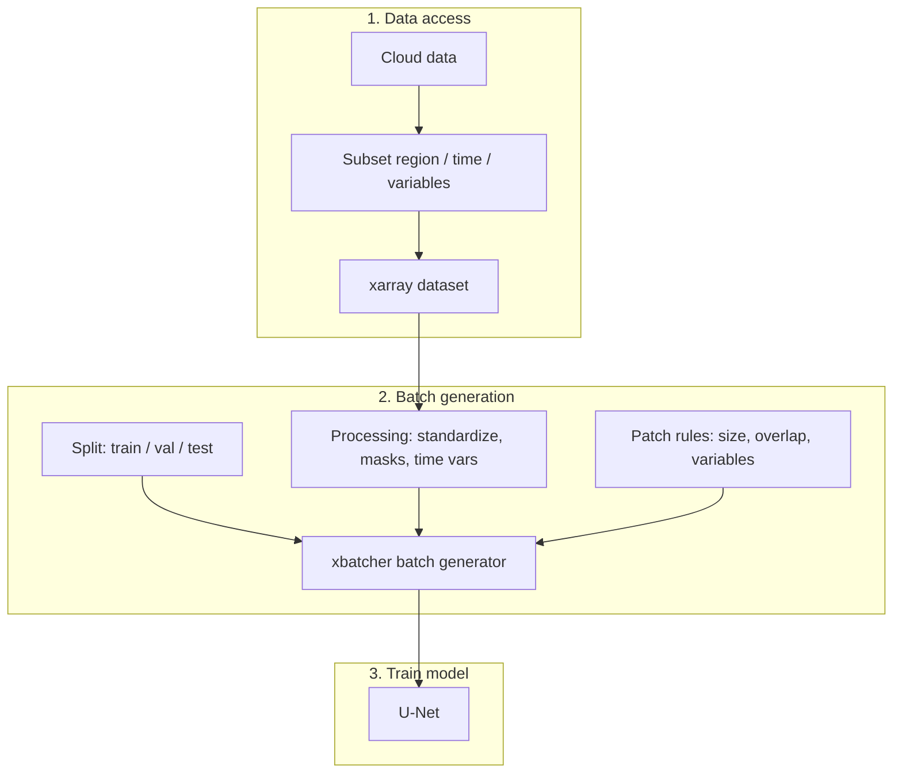

# Mind the Gap

`mindthegap` provides gap-filling functions for single-variable ocean color data
(e.g. chlorophyll) and multi-variable spectral data. It grew out of work started
by University of Washington Varanasi interns and developed further during GeoHackWeek 2024 and OceanHackWeek 2025
([proj_gap](https://github.com/oceanhackweek/ohw25_proj_gap)).

The primary model is a U-Net extended by SAFS Varanasi interns in 2026, as part of an UW eScience Acccelerator project in summer 2026.

## Pipeline

## Quick links

- [Installation](installation.md)
- [API Reference](api.md)
- [Source on GitHub](https://github.com/SAFS-Varanasi-Internship/mindthegap)
